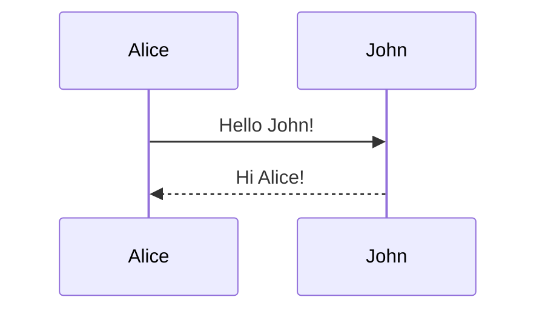

# Technical-writing
Here's a practical guide to README syntax with code examples for each element:

### Basic Markdown Syntax with Code Examples

#### 1. Headings
```markdown
# Main Title (H1)
## Section Header (H2)
### Subsection (H3)
#### Detail Header (H4)
```

#### 2. Text Formatting
```markdown
**Bold text**  
*Italic text*  
~~Strikethrough~~  
`Inline code`  
> Blockquote  
---
Horizontal rule
```

#### 3. Lists
```markdown
- Unordered item 1
- Unordered item 2
  - Nested item

1. Ordered item 1
2. Ordered item 2
   1. Nested ordered
```

#### 4. Links & Images
```markdown
[Link text](https://example.com)

[Reference link][1]

[1]: https://example-reference.com
```

#### 5. Code Blocks
````markdown
```python
# Python syntax highlighting
def hello():
    print("Hello World!")
```

```bash
# Shell commands
npm install
./run.sh
```
````

#### 6. Tables
```markdown
| Column 1     | Column 2     |
|--------------|--------------|
| Row 1 Cell 1 | Row 1 Cell 2 |
| Row 2 Cell 1 | Row 2 Cell 2 |
```

### Advanced README Elements

#### 1. Badges (Shields.io)
```markdown
[]()
[]()
[]()
```

#### 2. Collapsible Sections
```markdown
<details>
<summary>Click to expand</summary>

Hidden content here!  
More details...
</details>
```

#### 3. Emojis
```markdown
:rocket: Deployment  
:warning: Important note  
:bulb: Pro tip
```

#### 4. Task Lists
```markdown
- [x] Completed task
- [ ] Pending task
- [ ] Future task
```

#### 5. Mermaid Diagrams (GitHub supported)
````markdown

````

### Full README Structure Template
````markdown
# Project Name :rocket:

[](LICENSE)

One-sentence project description.

## Features
- Feature 1 :sparkles:
- Feature 2 :zap:
- Feature 3 :art:

## Installation
```bash
git clone https://github.com/you/project.git
cd project
pip install -r requirements.txt
```

## Usage
```python
import project

result = project.run_example()
print(result)
```

## Configuration
Create `.env` file:
```env
API_KEY=your_key_here
DEBUG=true
```

## Contributing
1. Fork the repository
2. Create your feature branch (`git checkout -b feature/amazing`)
3. Commit changes (`git commit -m 'Add amazing feature'`)
4. Push to branch (`git push origin feature/amazing`)
5. Open a Pull Request

## License
Distributed under the MIT License. See `LICENSE` for more information.
````

### Key Best Practices
1. **Start strong**: Clear project name + 1-sentence description in first 3 lines
2. **Visual hierarchy**: Use consistent heading levels
3. **Code examples**: Show real executable commands
4. **Visual aids**:
   ```markdown
   
   ```
5. **Keep updated**: Remove obsolete instructions immediately
6. **Mobile-friendly**: 
   - Use short lines (80-100 characters)
   - Avoid wide tables
   - Use relative links

### Tools for Validation
- **Markdown Linter**: [markdownlint](https://github.com/DavidAnson/markdownlint)
- **Preview**: VS Code with Markdown All in One extension
- **Badge Generator**: [Shields.io](https://shields.io)


